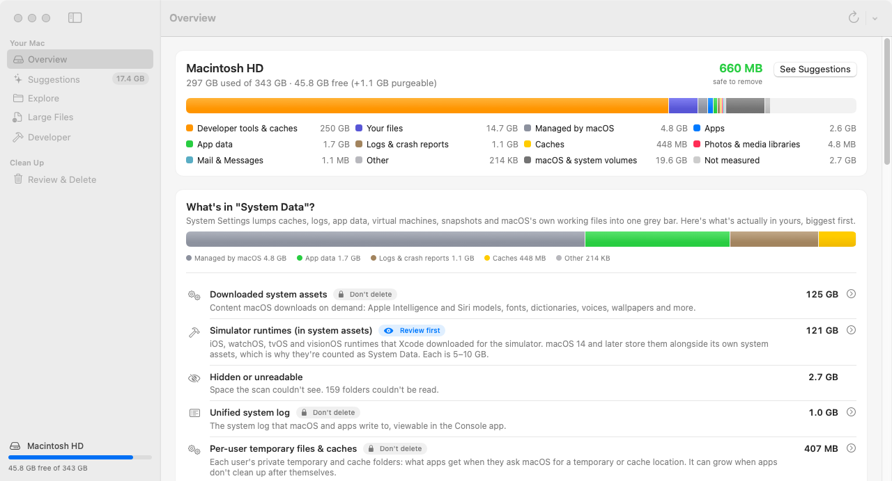
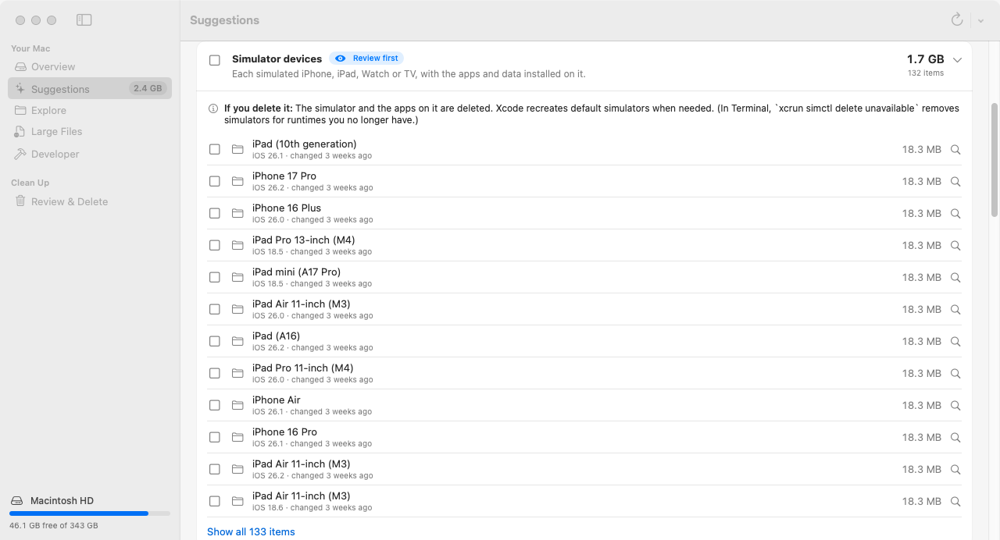
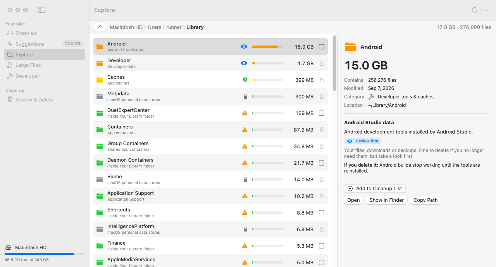

# Data Explorer

A Mac app that shows what's actually filling your disk, explains each thing in plain
language, and helps you safely delete what you don't need.

System Settings › General › Storage lumps a large share of most Macs into one grey bar
called **System Data**, with no way to look inside. Data Explorer opens it up. It measures
every folder, recognises more than 100 places where macOS and common apps keep things, and
tells you for each one:

- **What it is**, e.g. "Xcode build cache", "iPhone backup of Jono's iPhone",
  "Docker Desktop disk", "Per-user temporary files".
- **What happens if you delete it**, e.g. "Apps rebuild caches as you use them" or
  "You can't restore a device from that backup."
- **How safe it is**, on four levels:

| Level | Meaning | Can Data Explorer delete it? |
| --- | --- | --- |
| 🟢 **Safe to delete** | Rebuilt or re-downloaded automatically (caches, logs, build folders) | Yes |
| 🔵 **Review first** | Your own files, downloads and backups | Yes, after you review them |
| 🟠 **Use caution** | Data an app relies on; deleting can reset the app | Yes, with a warning |
| 🔒 **Don't delete** | Needed by macOS, or managed by another app (Photos, Mail, iCloud Drive…) | **No.** It shows you the right way to shrink it instead |



## What it shows you

- **Overview**: your disk as one bar, broken down into categories (apps, your files, caches,
  developer data, virtual machines, app data, system-managed space…), plus a ranked
  **"What's in System Data?"** list and the space macOS manages invisibly: the sealed macOS
  volume, swap, Preboot/Recovery, purgeable space and Time Machine local snapshots.
- **Suggestions**: everything recognised, biggest first, grouped by safety. Expand any card
  to see the individual items: which apps' caches, which device each backup belongs to, which
  project a build folder came from, and so on.
- **Explore**: browse folder by folder, sorted by size. Every row says what it is and how safe
  it is, and the inspector explains it in detail.
- **Large Files**: every file over 100 MB, with a guess at what it is.
- **Developer**: Xcode DerivedData, simulators, device support files, Docker, `node_modules`,
  Rust `target` folders, Python virtual environments, package-manager caches and more.
- **Review & Delete**: nothing is deleted until you've seen the full list and confirmed.
  Items go to the **Trash** by default, so you can put them back.

| Suggestions | Explore |
| --- | --- |
|  |  |

## Install

You need macOS 14 Sonoma or later.

### Build it yourself (recommended)

1. Install Xcode from the App Store, or just the command-line tools: `xcode-select --install`.
2. In Terminal:

   ```sh
   git clone https://github.com/jonomallanyk/macos-data-explorer.git
   cd macos-data-explorer
   ./scripts/build-app.sh
   open build
   ```

3. Drag **Data Explorer.app** into your Applications folder and open it.

### Or download a build

Every push builds the app on GitHub Actions. While signed in to GitHub, open the latest
successful [Build & test run](https://github.com/jonomallanyk/macos-data-explorer/actions/workflows/build.yml),
scroll to **Artifacts** at the bottom and download **Data-Explorer-app**. Double-click the
download to unzip it, then double-click the `Data-Explorer.zip` inside it to get
**Data Explorer.app**.

The app isn't notarised by Apple, so macOS blocks it the first time you open it. Click
**Done**, open **System Settings › Privacy & Security**, scroll down and click **Open Anyway**
next to the message about Data Explorer. (Or run
`xattr -dr com.apple.quarantine "Data Explorer.app"` in Terminal before opening it.)

### Give it Full Disk Access

macOS keeps Mail, Messages, Safari, other apps' containers and parts of your Library private.
Without Full Disk Access those folders show up as "couldn't read", and macOS may ask
for permission folder by folder.

1. Open **System Settings › Privacy & Security › Full Disk Access** (the app's banner has a
   button that takes you there).
2. Turn on **Data Explorer** (use **+** to add it from Applications if it isn't listed).
3. Quit and reopen Data Explorer.

Data Explorer only reads file sizes and names. It doesn't upload anything, and it doesn't use
the network at all.

## How it keeps you safe

- Every deletion is checked twice against a safety policy: once when the item is offered, and
  again right before it's deleted.
- It never deletes anything in `/System`, `/usr`, `/private` (swap, temporary files, system
  databases), keychains, iCloud Drive or other cloud folders, Mail or Messages storage,
  Photos/Music/TV libraries, the inside of app bundles, other users' folders, or any folder
  that contains folders macOS and apps expect to exist (such as your home or Library folder).
- It won't delete single code libraries or programs from inside an installed tool (a stray
  `.dylib` in an SDK, say), because that breaks the tool. You can still remove the whole tool.
- For things that shouldn't be deleted directly (Docker's disk image, the Spotlight index,
  Messages attachments, iCloud Drive, Homebrew, simulator runtimes…) it explains the proper
  way to free the space instead.
- Cache folders are emptied rather than removed, so apps find the folder where they expect it.
- "Move to Trash" is the default. Choose "Delete immediately" only when you're sure.
- Time Machine local snapshots are deleted with `tmutil`, after macOS asks for your password.

## What "System Data" usually contains

The biggest contributors Data Explorer tends to find:

- **App caches** (`~/Library/Caches`, browser and Electron app caches): safe to delete.
- **Developer data**: Xcode DerivedData, old device support files, simulators, Docker's
  virtual disk, package caches.
- **App data** in `~/Library/Application Support` and `~/Library/Containers`, including
  leftovers from apps you've already deleted.
- **iPhone/iPad backups** and downloaded device software.
- **Time Machine local snapshots** and other **purgeable** space macOS frees on its own.
- **Managed by macOS**: swap files, the Spotlight index, per-user temporary files
  (`/private/var/folders`), downloaded system assets (Apple Intelligence and Siri models,
  voices, fonts) and pending software updates.

## Development

```sh
swift test                 # unit tests for the scanner, knowledge base and safety policy
swift run DataExplorer     # run the app without bundling it
open Package.swift         # work on it in Xcode
```

The code is split in two:

- `Sources/DataExplorerCore`: no UI. The scanner (`DiskScanner`, built on `fts`), the
  catalogue of known locations (`Catalog.swift`), the `KnowledgeBase` that matches paths to
  it, the `SafetyPolicy`, the `ScanAnalyzer` that turns a scan into categories and
  suggestions, and the `CleanupEngine`.
- `Sources/DataExplorer`: the SwiftUI app.

To teach Data Explorer about another folder, add a `KnownLocation` to
`Sources/DataExplorerCore/Catalog.swift` with its path (`~` for home, `*` for any name), a
category, a safety level, a cleanup style and two short explanations. The tests check that
every entry is complete.

The screenshots above are taken by CI on a GitHub-hosted Mac. The `screenshots` job runs the
real app with `DATA_EXPLORER_SCREENSHOTS` set and commits the results to `docs/screenshots`.
It runs when a commit message contains `[screenshots]`, or on demand.

## Limitations

- Sizes are space actually allocated on disk. APFS clones (copies that share storage) are
  counted once per copy, so totals can slightly exceed what's really used.
- macOS doesn't report how big Time Machine local snapshots are, so they appear under
  "Hidden or unreadable" and "Purgeable".
- Only the startup disk is scanned when you choose "Entire Mac". Use "Scan a Folder…" for
  other disks.
- Files smaller than 1 MB are counted per folder rather than listed one by one, which keeps
  scans of millions of files fast and light on memory.
